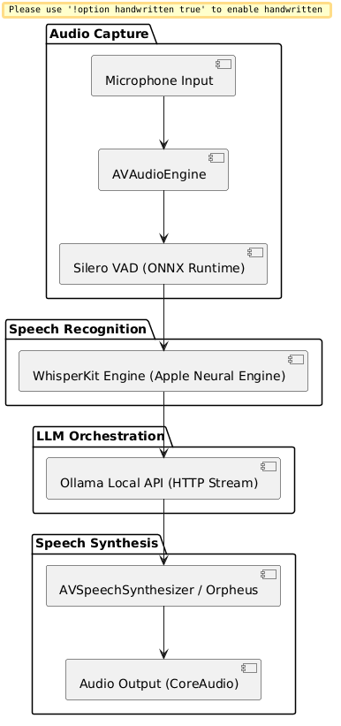

# VoicePOC

**Local-First Voice Engine & Proving Ground for macOS**

VoicePOC is a standalone, local-first conversation loop engineered for macOS Apple Silicon. It forms the audio and speech pipeline powering [Jarvis](https://github.com/KofTwentyTwo/Jarvis) — delivering real-time wake-word detection, speech-to-text (STT), streaming LLM orchestration, and text-to-speech (TTS) synthesis with zero cloud round-trips.

---

## Architecture & Audio Pipeline

VoicePOC operates as a 4-stage pipeline running local models on the Apple Neural Engine and GPU:



1. **Voice Activity Detection (VAD)**: Continuous low-power audio monitoring using Silero VAD over `onnxruntime` to filter ambient noise before triggering speech recognition.
2. **Speech-to-Text (STT)**: High-speed local speech recognition utilizing WhisperKit compiled directly for Apple Silicon hardware acceleration.
3. **Local LLM Streaming**: Asynchronous streaming event loop interfacing with a local Ollama server instance via high-throughput HTTP/IPC streams.
4. **Speech Synthesis (TTS)**: Low-latency audio output processing using native `AVSpeechSynthesizer` or local neural TTS engines.

---

## Technical Specifications

| Component | Technology | Target Hardware |
| :--- | :--- | :--- |
| **Language & Toolchain** | Swift 6.0 | macOS Apple Silicon (M1/M2/M3/M4) |
| **Speech Recognition** | WhisperKit (Argmax OSS) | Apple Neural Engine / CoreML |
| **VAD Runtime** | Silero VAD (ONNX Runtime 1.20) | CPU / GPU Acceleration |
| **LLM Interface** | Ollama Local Streaming API | Apple Silicon Unified Memory |
| **Audio Engine** | AVAudioEngine & CoreAudio | Native macOS Audio Stack |

---

## System Requirements

- **Operating System**: macOS 15.0+ or macOS 26.0+ (Apple Silicon `aarch64-apple-darwin`)
- **Developer Tools**: Xcode 16.0+ with Swift 6.0 toolchain & `xcodegen`
- **Dependencies**: Local `ollama` daemon installed (`brew install ollama`)

---

## Build & Installation

### Option 1: SwiftPM Library & CLI Build
```bash
# Build the core VoicePOCKit framework
swift build -c release

# Run integration tests
swift test
```

### Option 2: Xcode App Bundle via XcodeGen
```bash
# Generate the native Xcode project bundle
xcodegen generate

# Build and launch the standalone macOS application
xcodebuild -project VoicePOC.xcodeproj -scheme VoicePOC -configuration Debug build
```

---

## Quality Gates & Verification

```bash
# 1. Compiler & Linter Verification
swift build --target VoicePOCKit

# 2. Run Test Suite
swift test --filter VoicePOCTests
```

---

## License & Credits

- **License**: MIT License. See [LICENSE](LICENSE) for details.
- **Open Source Dependencies**: WhisperKit by Argmax, ONNX Runtime by Microsoft, Swift Log by Apple.
